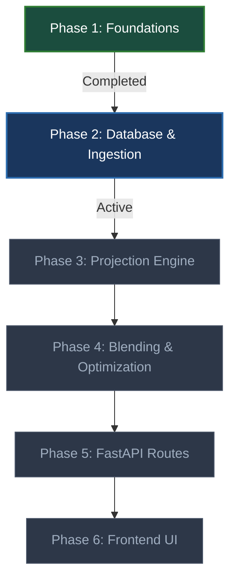

# FPL Jubilee Ascent - Project Roadmap

This roadmap tracks the development progress of the FPL Jubilee Ascent monorepo. It highlights completed items, current priorities, and the architectural design for future modules.

---

## Current Project Status: **Phase 2 (Database & Ingestion Setup)**



---

## Implementation Phases

### ✅ Phase 1: Repo Infrastructure & API Client (Completed)
- [x] Initial monorepo layout setup (`backend/`, `frontend/`, `data/`, `docs/`).
- [x] Backend dependencies managed with `uv` and linting with `ruff`.
- [x] Frontend scaffolded with Next.js 14, TypeScript, and Vanilla CSS.
- [x] Playwright-based SSO login handler (`fpl_auth.py`) extracting authenticated JWT tokens.
- [x] Core FPL API Client (`fpl_api.py`) implemented with retry rules (via `tenacity`) and `x-api-authorization` Bearer headers.
- [x] Integration and unit testing suite verifying authentication and public/private endpoint fetching.

---

### ⏳ Phase 2: Database Schema & Ingestion (Active)
- [ ] Create SQLAlchemy relational models in `backend/app/models/` for the 9 core entities defined in ADR 0003:
  1. `clubs`
  2. `positions` (lookup/enum)
  3. `gameweeks`
  4. `players`
  5. `fixtures`
  6. `player_gameweek_performances`
  7. `player_past_seasons`
  8. `user_squad_picks`
  9. `user_state`
  Use synchronous SQLAlchemy connection handling (via `psycopg2`) for simple, robust session injection.
- [ ] Initialize and execute Alembic migrations to build the tables in PostgreSQL.
- [ ] Implement database ingestion service in `backend/app/services/ingestion.py` that couples fetching raw JSON from the FPL API, writing the JSON to the gitignored `data/raw/` cache, and writing normalized records directly to Postgres. Use an upsert strategy (`ON CONFLICT DO UPDATE`) to safely persist updates while keeping foreign key integrity. Ensure all external API calls are made via the client handlers in `backend/app/clients/` (as per Safety Rules).
- [ ] Add unit and integration tests for DB models, migrations, and the coupled sync/ingest service. Run tests against a dedicated test PostgreSQL database with transaction rollbacks for isolation.

---

### 📋 Phase 3: Modular Projection Engine (xP Model) (Planned)
- [ ] Define **Feature Contract** (inputs schema for models).
- [ ] Define standard **Model Adapter** interface.
- [ ] Implement feature engineering logic in Python using `pandas` to compute rolling stats, lags, and difficulty offsets from raw database tables.
- [ ] Implement baseline statistical model (rolling average points adjusted by fixture difficulty) complying with the Model Adapter.
- [ ] Setup point projection tables in Postgres with version tracking (`model_version`, `run_at`).
- [ ] Future extension: Integration of machine learning models (scikit-learn / XGBoost).

---

### 📋 Phase 4: Blending & Optimization Engine (MILP) (Planned)
- [ ] Define the **LLM Factor Contract** schema.
- [ ] Implement the **LLM Blending** service using `LLM_WEIGHT`:
  $$\text{blended\_minutes} = (\text{LLM\_WEIGHT} \times \text{llm\_minutes}) + ((1 - \text{LLM\_WEIGHT}) \times \text{model\_projected\_minutes})$$
  Ensure the blender checks the `LLM_WEIGHT` flag first: if `LLM_WEIGHT` is `0.0`, disable calling the LLM tool entirely. Ensure the generator outputs are validated against the contract schema before blending.
- [ ] Implement the **Point Calculator** module to combine blended minutes with predicted performance stats to output final xP.
- [ ] Implement the MILP Solver (`backend/app/services/optimizer.py`) using PuLP:
  - Use the default CBC solver packaged with PuLP (zero extra configuration or licensing overhead).
  - Supports configurable multi-gameweek planning horizon (3-8 gameweeks).
  - Handles budget constraints (bank, player costs), squad size restrictions (15-man squad), position quotas, and transfer cost penalties.

---

### 📋 Phase 5: FastAPI Routes & Async Tasks (Planned)
- [ ] Implement asynchronous trigger endpoints using FastAPI `BackgroundTasks` for long-running synchronization and optimization runs (returning a task ID for the client to poll).
- [ ] Implement endpoints to query current user squad details, projection scores, and optimized transfer recommendations.

---

### 📋 Phase 6: Frontend UI Dashboard (Planned)
- [ ] Pitch view representing current 15-man squad (starters and bench).
- [ ] Optimizer UI panel: configure planning horizon, model type, and `LLM_WEIGHT` to trigger optimizations.
- [ ] Visual transfer plan recommendations table and expected point projection charts.

---

## Target Pipeline Architecture

```
                                  +-----------------------+
                                  |     FPL Live API      |
                                  +-----------+-----------+
                                              |
                                              v (Coupled Sync/Ingest)
+-----------------------+         +-----------+-----------+
|  Local Raw JSON Cache | <-------+  Ingestion Service    |
|      (data/raw/)      |         +-----------+-----------+
+-----------------------+                     |
                                              v
                                  +-----------+-----------+
                                  |  PostgreSQL Database  |
                                  +-----------+-----------+
                                              |
                                              v (Feature Contract)
                                  +-----------+-----------+
                                  |     Model Adapter     |
                                  +-----------+-----------+
                                              |
                                              v (Predicted Minutes & Stats)
+-----------------------+                 [Blender]
|  LLM Factor Generator | --------------------> (LLM_WEIGHT)
+-----------------------+                     |
                                              v
                                  +-----------+-----------+
                                  |    Point Calculator   |
                                  +-----------+-----------+
                                              |
                                              v (Final Expected Points xP)
                                  +-----------+-----------+
                                  |  MILP Solver (PuLP)   |
                                  +-----------+-----------+
                                              |
                                              v
                                  +-----------+-----------+
                                  | FastAPI / Next.js UI  |
                                  +-----------------------+
```

---

> [!NOTE]
> All developments must follow the **Pre-commit gate**: run all test and lint commands successfully before proposing commits.
