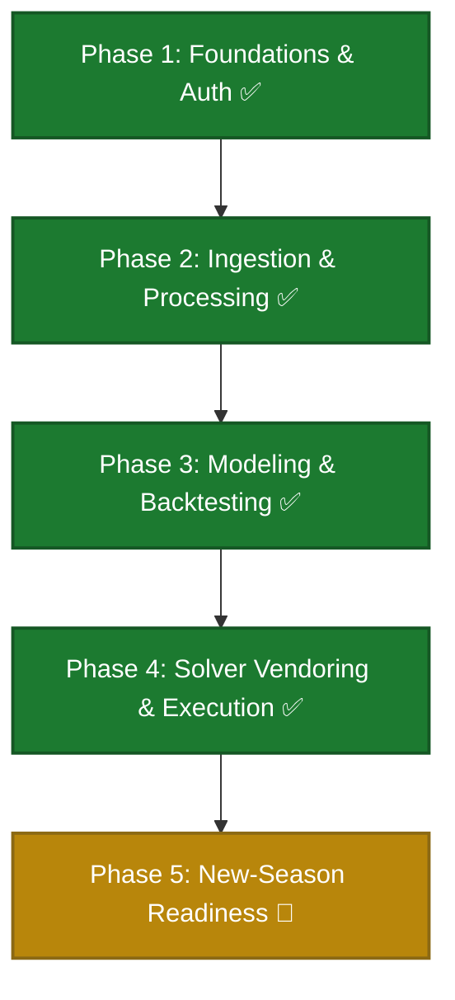

# FPL-Jubilee-Ascent - Project Roadmap

This roadmap tracks the development progress, target architecture, and phases for **FPL-Jubilee-Ascent**.

> **Agents:** read [`docs/agents/current-state.md`](docs/agents/current-state.md) first for what is built today vs this plan.

---

## Personas

| Persona | Goal | Primary surface |
|---------|------|-----------------|
| **User** | Run data refresh, backtest models, run solver to get optimal transfer plans | CLI |
| **Developer** | Plug in new score projection models | Python classes / CLI |

---

## Current Project Status: **Phases 1-4 complete; Phase 5 (new-season readiness) active**

---

## Implementation Phases

### ✅ Phase 1: Repo Infrastructure, Foundations & Auth (Completed)
All repository scaffolding, tiered authentication (Playwright, direct HTTP, environment tokens), and developer checks (ruff, pytest) are fully implemented.

---

### ✅ Phase 2: Ingestion, Processing & Archiving (Completed)
Raw data refresh pipeline, historical season snapshot scripts, and raw-to-parquet processors are fully implemented.

---

### ✅ Phase 3: Pluggable Modeling & Backtesting (Completed)
Baseline models, feature and projection exporters, and historical backtesting evaluations are fully implemented.

---

### ✅ Phase 4: Solver Vendoring & Execution (Completed)
Vendored MILP solver, multi-period transfer optimization wrapper, and top-picks console/CSV rank reports are fully implemented.

---

### 🚧 Phase 5: New-Season Readiness (Active — GitHub issues)

Motivation: at a new season's GW1, current-season history is empty so `linear_baseline` projects 0 for everyone → solver picks a meaningless squad. Goal: a component model seeded from prior-season archive that works at Cold-Start and stays sound as current-season data arrives.

Start with the critical path; design in `docs/adr/0003-reconstruct-points-from-event-components.md`, vocabulary in `CONTEXT.md`.

| Issue | Title | Blocked by | Notes |
|-------|-------|-----------|-------|
| #77 | FPL scoring matrix module | — | ✅ Done. All 12 Event Components; 19 tests. |
| #84 | Component model w/ Prior-Season Seed (mid-season) | #77 | ✅ Done. `models/component_baseline.py`; per-90 rates in `features/builder.py`. Backtest beats linear_baseline. |
| #85 | Cold-Start fallback + current-season blend | #84 | ✅ Done. Prior-season seed + Position-Price Prior fallback + appearance blend + GW1-4 cold-start guard. |
| #83 | Long-format Feature Contract (Planning Horizon) | #77 | **Start here.** Fixes GW39-42 inheriting GW38 fixture. |
| #86 | Per-component fixture difficulty | #84, #83 | Attack/defence multipliers from FPL API difficulty. |
| #87 | Fixture difficulty (FDR) report | #83 | Club × horizon-GW difficulty table. |
| #78 | Auto team_id from /api/me | — | Quick win. |
| #79 | Captain & vice report | — | Quick win. |
| #80 | Chip booking feasibility validation | — | Quick win. |
| #81 | Price-change tracking | — | Quick win. |
| #82 | Tuning surface (horizon/decay) | — | Quick win. |

---

> [!NOTE]
> **Pre-commit gate:** run all test and lint commands successfully before proposing commits.
