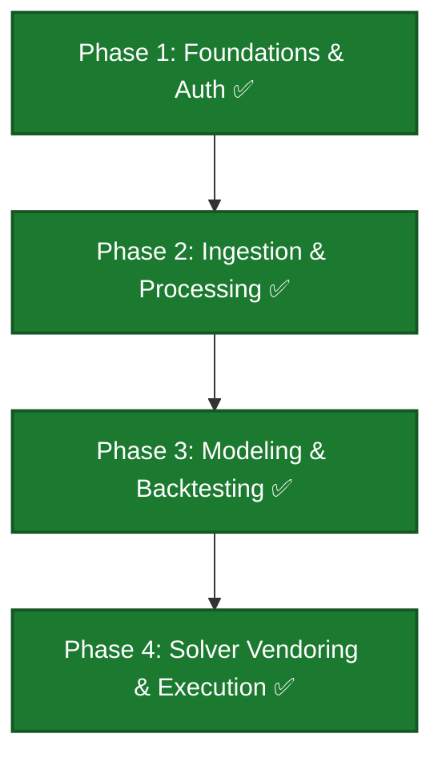

# FPL-Jubilee-Ascent - Project Roadmap

This roadmap tracks the development progress, target architecture, and phases for **FPL-Jubilee-Ascent**.

> **Agents:** read [`docs/agents/current-state.md`](docs/agents/current-state.md) first for what is built today vs this plan.

---

## Personas

| Persona | Goal | Primary surface |
|---------|------|-----------------|
| **User** | Run data refresh, backtest models, run solver to get optimal transfer plans | CLI |
| **Developer** | Plug in new score projection models | Python classes / CLI |

---

## Current Project Status: **Complete (All Phases Implemented)**

---

## Implementation Phases

### ✅ Phase 1: Repo Infrastructure, Foundations & Auth (Completed)
All repository scaffolding, tiered authentication (Playwright, direct HTTP, environment tokens), and developer checks (ruff, pytest) are fully implemented.

---

### ✅ Phase 2: Ingestion, Processing & Archiving (Completed)
Raw data refresh pipeline, historical season snapshot scripts, and raw-to-parquet processors are fully implemented.

---

### ✅ Phase 3: Pluggable Modeling & Backtesting (Completed)
Baseline models, feature and projection exporters, and historical backtesting evaluations are fully implemented.

---

### ✅ Phase 4: Solver Vendoring & Execution (Completed)
Vendored MILP solver, multi-period transfer optimization wrapper, and top-picks console/CSV rank reports are fully implemented.

---

> [!NOTE]
> **Pre-commit gate:** run all test and lint commands successfully before proposing commits.
