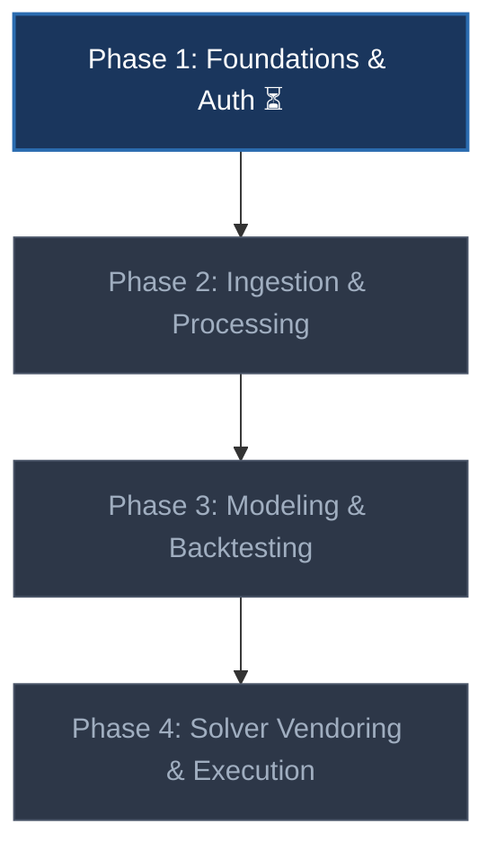

# FPL-Jubilee-Ascent - Project Roadmap

This roadmap tracks the development progress, target architecture, and phases for **FPL-Jubilee-Ascent**.

> **Agents:** read [`docs/agents/current-state.md`](docs/agents/current-state.md) first for what is built today vs this plan.

---

## Personas

| Persona | Goal | Primary surface |
|---------|------|-----------------|
| **User** | Run data refresh, backtest models, run solver to get optimal transfer plans | CLI |
| **Developer** | Plug in new score projection models | Python classes / CLI |

---

## Current Project Status: **Phase 1 (Active)**

---

## Implementation Phases

### ⏳ Phase 1: Repo Infrastructure, Foundations & Auth (Active)
- [x] Initialize repository packages and virtualenv with dependencies.
- [/] Refactor `fpl_auth.py` to support tiered direct HTTP, manual token, and Playwright login.
- [ ] Configure testing with pytest and code formatting with ruff.

---

### 📋 Phase 2: Ingestion, Processing & Archiving (Planned)
- [ ] Implement command to refresh raw FPL API data.
- [ ] Implement command to archive/snapshot the 2025/26 season raw JSON.
- [ ] Process raw JSON into Parquet tables (players, clubs, gameweeks, fixtures, performances).

---

### 📋 Phase 3: Pluggable Modeling & Backtesting (Planned)
- [ ] Implement `BaseModel` contract and linear rolling baseline model.
- [ ] Construct feature compiling and projection exporting contracts.
- [ ] Implement backtesting command to run and score model projections against historical Parquet data.

---

### 📋 Phase 4: Solver Vendoring & Execution (Planned)
- [ ] Vendor open-fpl-solver modules into repository.
- [ ] Implement solve script wrapper taking generated score projections CSV.
- [ ] Implement unconstrained top-picks report script generating console/CSV rankings.

---

> [!NOTE]
> **Pre-commit gate:** run all test and lint commands successfully before proposing commits.
